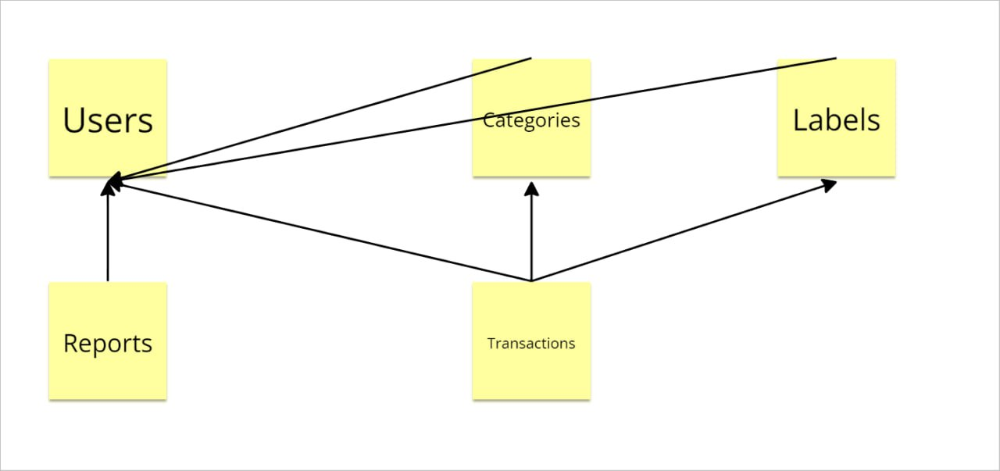

# Design Document

By Timur Makukha

## Video Overview

Video overview: (Normally there would be a URL here, but not for this sample assignment!)

## Purpose

This database is designed to help users manage their personal finances by allowing them to import bank statements, categorize transactions, and generate various financial reports.

## Scope

The system will handle:

- User information
- Categories for transactions
- Labels for frequent transaction parties
- Transactions data
- Financial reports

## Entities and Relationships

- Users: Represents the users of the system.
- Categories: Categories for classifying transactions (e.g., Groceries, Utilities).
- Labels: Custom labels for frequent transaction parties.
- Transactions: Individual transactions with references to users, categories, and labels.
- Reports: Generated financial reports for users.

## Optimizations

- Indexes on frequently queried fields such as UserID, CategoryID, and TransactionDate.
- Use of foreign keys to maintain data integrity.
- Proper normalization to reduce redundancy.

## Limitations

- No direct connection to bank accounts; users must import bank statements manually.
- Limited to SQL-based databases; no support for NoSQL at this stage.

## Entity Relationship Diagram

## Entities and Relationships

- **Users**: Represents the users of the system.
- **Categories**: Categories for classifying transactions (e.g., Groceries, Utilities).
- **Labels**: Custom labels for frequent transaction parties.
- **Transactions**: Individual transactions with references to users, categories, and labels.
- **Reports**: Generated financial reports for users.

Relationships:

- **Users** to **Categories**: One-to-many relationship through `UserID`.
- **Users** to **Labels**: One-to-many relationship through `UserID`.
- **Users** to **Transactions**: One-to-many relationship through `UserID`.
- **Users** to **Reports**: One-to-many relationship through `UserID`.
- **Categories** to **Transactions**: One-to-many relationship through `CategoryID`.
- **Labels** to **Transactions**: One-to-many relationship through `LabelID`.
